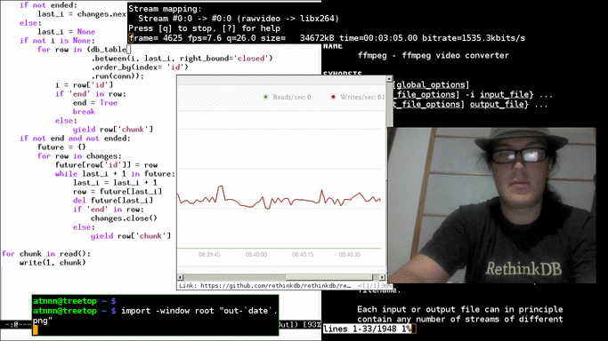

# Video streaming with RethinkDB

This demo shows that streaming video is possible with [RethinkDB
changefeeds](http://rethinkdb.com/blog/realtime-web/). It even
supports recording multiple streams at the same time and streaming to
multiple viewers.



# Usage

Record video from your webcam into a RethinkDB table called 'hello':

```
./stream_webcam 127.0.0.1 28015 hello
```

Live stream the 'hello' table:

```
./play_stream 127.0.0.1 28015 hello
```


Stream from the 'hello' table starting at the beginning:

```
./play_stream 127.0.0.1 28015 hello 0
```

# Data format

Data is formatted as chunks (with a default size of 1 KiB). Each chunk
is associated with an auto-incremented integer id and stored in the
table associated with the stream.

```
{
  "id": 0,
  "chunk": r.binary(...)
}
```

The last document in the stream has an `end` field instead of `chunk`.

```
{
  "id": 2294,
  "end": true
}
```